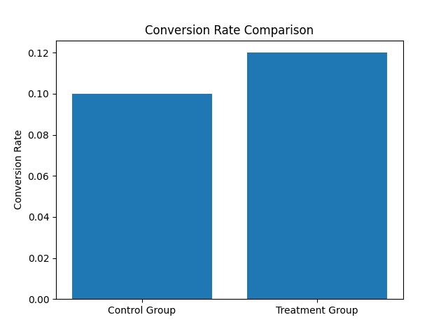
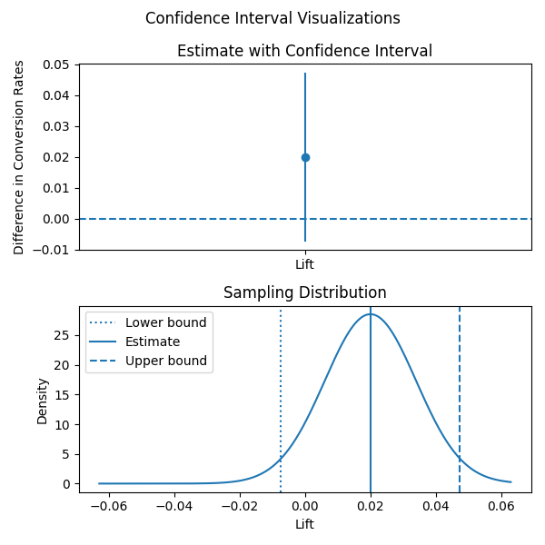
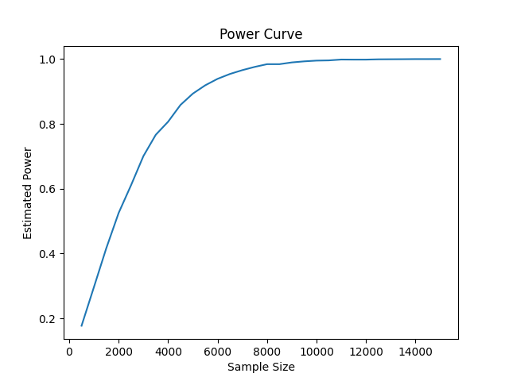

# A/B Testing Framework in Python

## Overview

This project is a Python-based A/B testing framework built from scratch to perform statistical analysis of online experiments. The goal of the project is to understand and implement the core statistical concepts behind experimentation rather than relying on pre-built libraries.

The framework supports:

* Conversion rate analysis
* Absolute and relative lift calculations
* Two-proportion z-tests
* Confidence interval estimation
* Statistical power analysis
* Sample size calculation
* Monte Carlo simulation of A/B tests
* Empirical power estimation
* Visualization of experiment results

The project was developed as a learning exercise in applied statistics, hypothesis testing, and experimental design.

---

## Statistical Concepts Implemented

### Metrics

* Conversion Rate
* Absolute Lift
* Relative Lift

### Hypothesis Testing

* Two-Proportion Z-Test
* Two-Sided Significance Testing
* P-Value Calculation
* Critical Value Based Decision Rule

### Confidence Intervals

* Confidence Interval for Difference in Proportions
* Confidence-Level Based Interval Construction

### Power Analysis

* Minimum Detectable Effect (MDE)
* Type I Error (α)
* Type II Error (β)
* Statistical Power (1 − β)
* Required Sample Size Calculation

### Monte Carlo Simulation

* Simulation of Control and Treatment Groups using Binomial Sampling
* Empirical Power Estimation through Repeated Experiments

---

## Project Structure

```text
ab-testing-framework/
│
├── metrics.py
├── hypothesis_testings.py
├── confidence_intervals.py
├── power_analysis.py
├── simulation.py
├── visualization.py
├── experiment.py
├── main.py
└── README.md
```

### Module Description

| File                    | Purpose                                        |
| ----------------------- | ---------------------------------------------- |
| metrics.py              | Conversion rates and lift calculations         |
| hypothesis_testings.py  | Two-proportion z-test implementation           |
| confidence_intervals.py | Confidence interval construction               |
| power_analysis.py       | Sample size and power calculations             |
| simulation.py           | Monte Carlo simulation utilities               |
| visualization.py        | Statistical visualizations                     |
| experiment.py           | Experiment class integrating all functionality |
| main.py                 | Demonstration script                           |

---

## Example Usage

```python
from experiment import Experiment

experiment = Experiment(
    treatment_conversions=120,
    treatment_size=1000,
    control_conversions=100,
    control_size=1000
)

print(experiment)
```

Example output:

```text
A/B Test Summary
-----------------
Control Conversion Rate   : 0.1000
Treatment Conversion Rate : 0.1200
Absolute Lift             : 0.0200
Relative Lift             : 20.00%
Required Sample Size      : 3839
Z Statistic               : 1.4293
Z Critical                : 1.9600
P Value                   : 0.1529
Reject Null               : False
Confidence Interval       : (-0.0074, 0.0474)
```

---

## Visualizations

The framework includes:

### Conversion Rate Comparison

* Bar chart comparing treatment and control conversion rates.



### Confidence Interval Visualization

* Error-bar representation of the confidence interval.
* Sampling distribution visualization showing:

  * Lower confidence bound
  * Estimated lift
  * Upper confidence bound



### Power Curve

* Estimated statistical power plotted against sample size.
* Generated using Monte Carlo simulation.



---

## Monte Carlo Validation

The project includes a simulation engine that repeatedly generates randomized experiments using binomial sampling.

This simulation is used to:

* Validate the theoretical power analysis calculations.
* Estimate empirical power by measuring the proportion of experiments that correctly reject the null hypothesis.

For example, for:

* Baseline Conversion Rate = 10%
* Treatment Conversion Rate = 12%
* Target Power = 80%
* Significance Level = 5%

the theoretical sample size calculation and Monte Carlo simulations produce consistent results.

---

## Key Learning Outcomes

Through this project, the following concepts were implemented and validated from first principles:

* Bernoulli and Binomial Models
* Sampling Distributions
* Standard Errors
* Confidence Intervals
* Two-Proportion Z-Tests
* Type I and Type II Errors
* Statistical Power
* Sample Size Determination
* Monte Carlo Simulation

---

## Future Improvements

Potential extensions include:

* Unequal allocation ratios
* Sequential testing methods
* Bayesian A/B testing
* Multiple testing corrections
* Support for continuous metrics
* Dashboard integration using Streamlit

---

## Technologies Used

* Python
* NumPy
* Matplotlib
* Statistics Module (Python Standard Library)

---